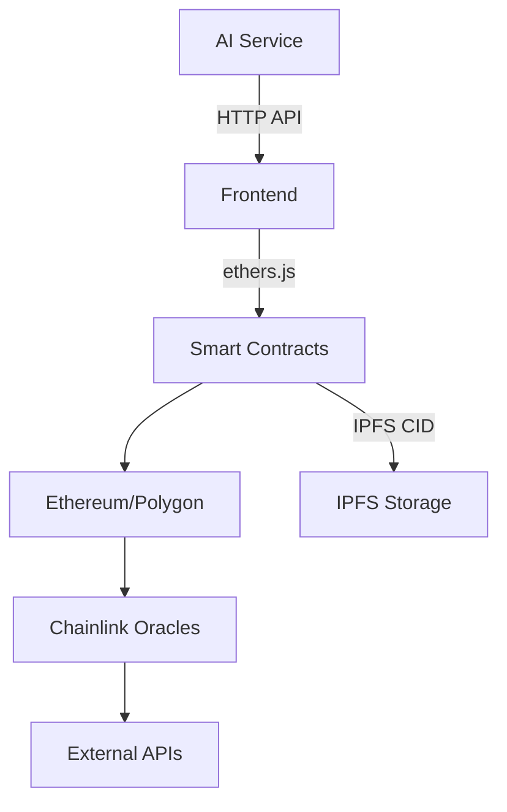

# Decentralized Voting DApp


[](https://soliditylang.org)
[](https://react.dev)
[](https://hardhat.org)
[](https://chain.link)
[](LICENSE)

## About The Project

The Decentralized Voting DApp is a comprehensive blockchain-based platform for transparent, secure, and efficient governance. Built for DAOs, organizations, and communities, it combines token-based voting mechanisms with AI-powered security to create a seamless governance experience.

### Key Features

- **Token-Based Governance**: Support for ERC-20 and ERC-721 token gating
- **Transparent Voting**: Immutable on-chain record of all votes
- **Multi-Chain Support**: Deploy on Ethereum, Polygon, and other EVM chains
- **Fraud Detection**: AI-powered security monitoring (Phase 2)
- **User-Friendly Interface**: Accessible voting for both Web3 experts and newcomers
- **Delegation System**: Token holders can delegate voting power
- **Proposal Management**: Create, track, and execute governance proposals

### Demo

🔗 [Live Demo](https://voting-dapp-demo.com) | [Video Walkthrough](https://youtube.com/demo)


## Technology Stack

### Blockchain
- **Networks**: Ethereum, Polygon
- **Smart Contracts**: Solidity 0.8.25
- **Contract Libraries**: OpenZeppelin
- **Development**: Hardhat & Foundry
- **Interoperability**: Chainlink CCIP

### Frontend
- **Framework**: React 18 with TypeScript
- **Web3 Integration**: ethers.js 6.9
- **UI Components**: Material UI 
- **State Management**: Redux Toolkit
- **Data Visualization**: Chart.js

### Backend & APIs
- **API Gateway**: Node.js/Express
- **Data Storage**: IPFS/web3.storage
- **Caching**: Redis
- **Database**: PostgreSQL
- **AI Services**: TensorFlow (Python)

## System Architecture



## Smart Contract System

The DApp consists of several interconnected smart contracts:

- **VotingCore.sol**: Central voting mechanism with token validation
- **ProposalManager.sol**: CRUD operations for governance proposals
- **Delegation.sol**: Vote delegation functionality
- **TokenRegistry.sol**: Governance token validation and tracking
- **ExecutionTimelock.sol**: Time-delayed execution of passed proposals

### Example Contract Usage

```solidity
// Creating a new proposal
function createProposal(
    string memory title,
    string memory description,
    string memory ipfsHash,
    address[] memory targets,
    uint256[] memory values,
    bytes[] memory calldatas
) external returns (uint256 proposalId) {
    // Implementation details
}

// Casting a vote
function castVote(uint256 proposalId, uint8 support) external returns (uint256 weight) {
    // Implementation details
}
```

## Project Structure

```
voting-dapp/
├── .github/                      # GitHub Actions workflows
│   └── workflows/
│       └── ci.yml               # CI/CD pipeline configuration
├── contracts/                    # Smart contracts
│   ├── VotingCore.sol           # Main voting functionality
│   ├── ProposalManager.sol      # Proposal management
│   ├── Delegation.sol           # Vote delegation
│   └── TokenRegistry.sol        # Token validation
├── scripts/                      # Deployment and task scripts
│   └── deploy.js                # Contract deployment script
├── test/                         # Test files
│   └── Voting.test.js           # Smart contract tests
├── frontend/                     # Frontend application (to be added)
├── api/                          # Backend API services (to be added)
├── .env.example                  # Environment variables template
├── .gitignore                    # Git ignore file
├── .solhint.json                 # Solidity linting rules
├── hardhat.config.js             # Hardhat configuration
├── package.json                  # Project dependencies
└── README.md                     # Project documentation
```

## Installation and Setup

### Prerequisites
- Node.js (v16+)
- npm or yarn
- MetaMask browser extension

### Local Development

1. Clone the repository
```bash
git clone https://github.com/your-org/voting-dapp.git
cd voting-dapp
```

2. Install dependencies
```bash
npm install
```

3. Configure environment variables
```bash
cp .env.example .env
# Edit .env with your values
```

4. Start local blockchain
```bash
npx hardhat node
```

5. Deploy contracts to local node
```bash
npx hardhat run scripts/deploy.js --network localhost
```

6. Start frontend application
```bash
npm run start
```

## Usage Guide

### For Voters
1. Connect your wallet containing governance tokens
2. Browse active proposals on the dashboard
3. Review proposal details and supporting documentation
4. Cast your vote or delegate your voting power
5. Track proposal status and execution

### For DAO Administrators
1. Access the admin panel via token-gated authentication
2. Create new proposals with execution parameters
3. Set voting parameters (duration, quorum, etc.)
4. Monitor voting analytics and participation metrics
5. Execute passed proposals after timelock period

### API Integration

The platform offers a REST API for integration with other systems:

```javascript
// Example API usage with axios
const response = await axios.get('https://api.voting-dapp.com/proposals', {
  headers: { 'Authorization': 'Bearer YOUR_API_KEY' }
});

const proposalData = response.data;
```

## Business Models

The platform offers multiple pricing tiers to accommodate different organization sizes and needs:

### Full Platform (SaaS)
- **Basic Tier**: $99/month - Single chain, 10 active proposals
- **Pro Tier**: $299/month - Multi-chain, advanced analytics
- **Enterprise**: Custom pricing - White-label solution

### NFT Voting Widget (Micro SaaS)
- One-time $499 setup fee
- $0.001 per vote processed

### AI Services (API Access)
- Fraud Detection: $5 per 1000 API calls
- Proposal Generator: $0.10 per generation

## Roadmap

- **Q2 2024**: Mobile app development
- **Q3 2024**: ZK-SNARKs for privacy-preserving voting
- **Q4 2024**: DAO treasury management integration
- **Q1 2025**: Advanced AI governance advisors

## Contributing

We welcome contributions from the community! Please see our [Contributing Guide](CONTRIBUTING.md) for details on how to get started.

## License

Distributed under the MIT License. See `LICENSE` for more information.

## Contact

Project Link: [https://github.com/your-org/voting-dapp](https://github.com/your-org/voting-dapp)

---

*Last updated: April 14, 2025*