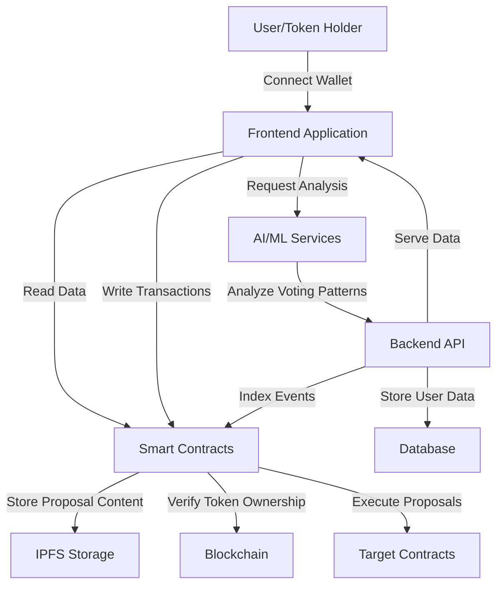
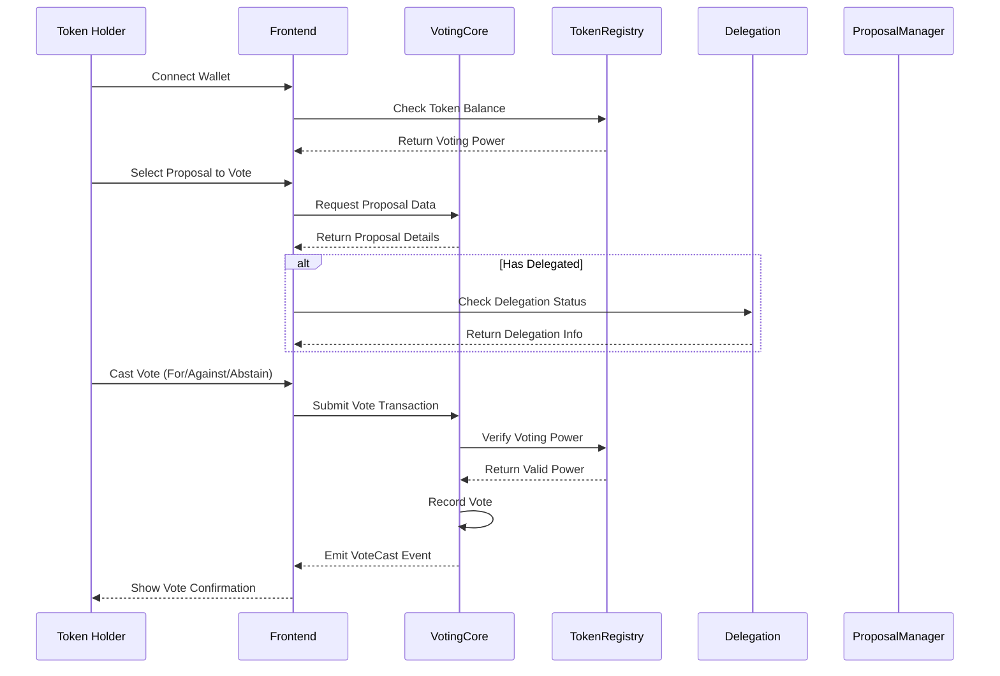
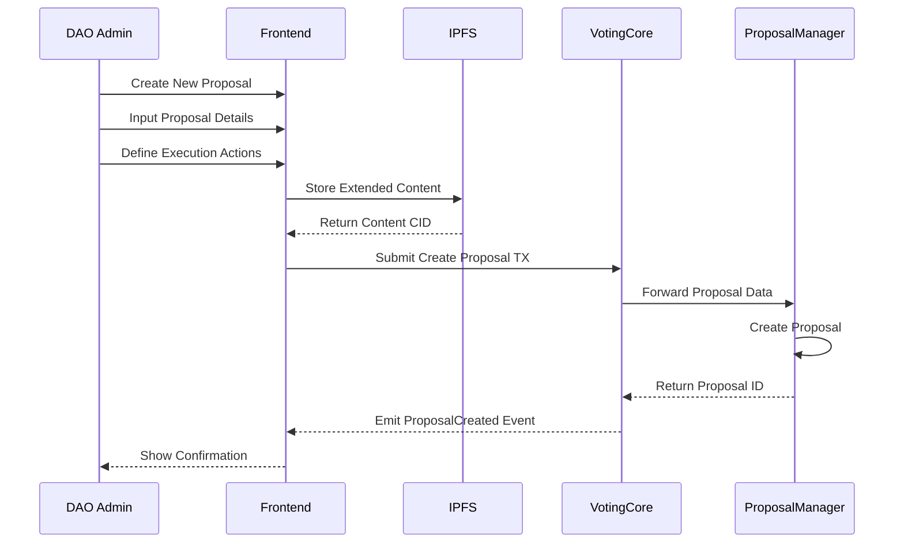
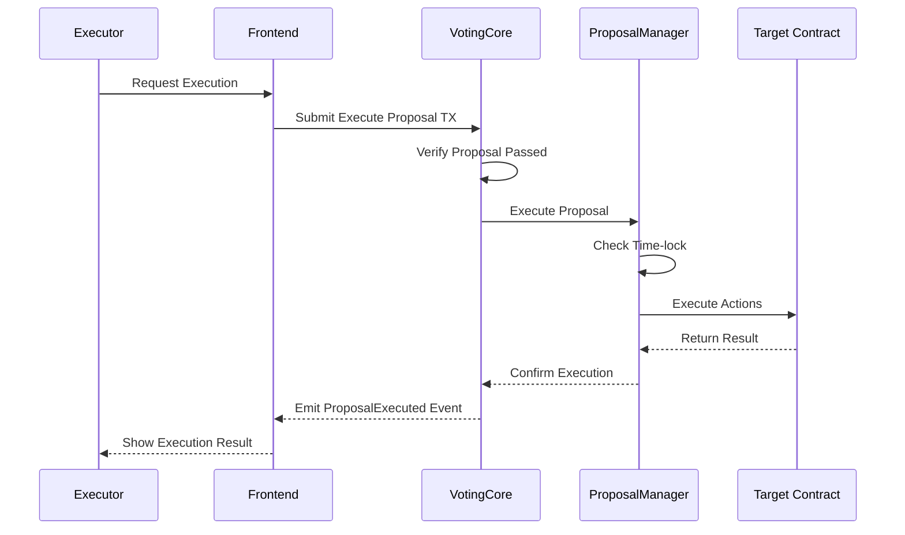
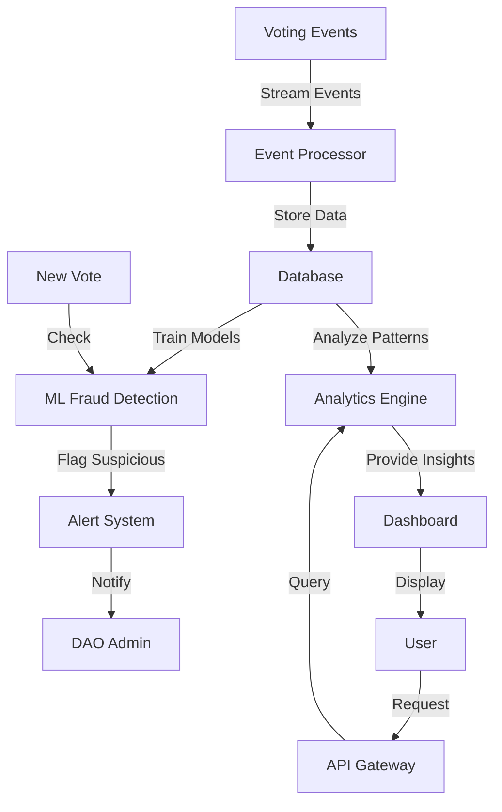
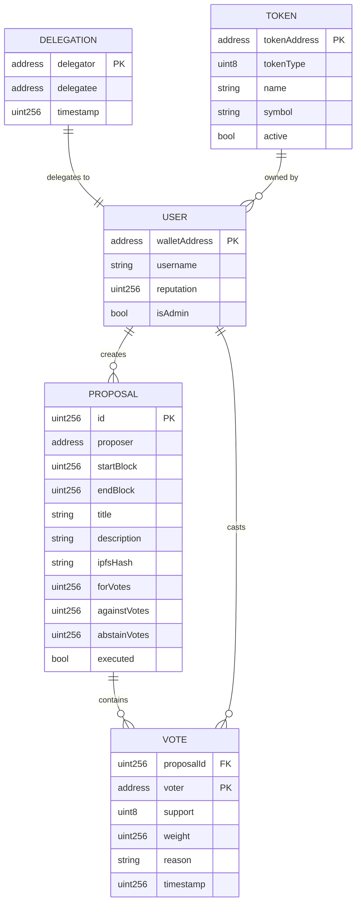

# Voting DApp Data Flow Diagram

## System-Level Data Flow

## Vote Casting Flow

## Proposal Creation Flow

## Proposal Execution Flow

## AI Integration Flow

## Data Storage Model

This data flow diagram illustrates the complete flow of information through the Voting DApp system, from user interactions to blockchain transactions and data storage. The diagram should help guide the implementation of the smart contracts and their interactions with frontend and backend services.
